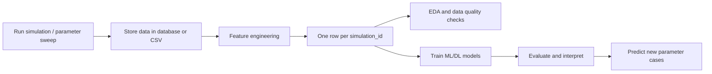

# Biofilm Simulation Data Analysis and Prediction Platform

This project organizes an existing biofilm simulation workflow into a GitHub-ready research platform for simulation export, relational database storage, feature engineering, EDA, machine learning, deep learning, and interactive prediction.

The original browser/Artistoo simulation files are preserved in `src/main.js`, `src/artistoo-worker.js`, `src/ns_simple.py`, and related files. The Python runner in `simulation/` is an export-oriented companion that keeps the same near-wall biofilm assumptions while adding stable batch simulation, standardized outputs, and database writing.

## What The Platform Does

The platform predicts final biofilm outcomes from simulation parameters and early-stage process data.

Inputs:

- simulation parameters
- early cell-level records
- early cluster-level records
- flow-field records

Outputs:

- `biofilm_thickness`
- `surface_coverage`
- `roughness`
- `eps_fraction`
- `cluster_count`
- `time_to_stable_biofilm`

## Research Workflow



Important modeling rule:

```text
cell-level rows
→ group by simulation_id and timepoint
→ extract biofilm-level features
→ pivot early timepoints
→ one training row per simulation_id
→ predict final biofilm-level outcomes
```

## Database Tables

The project uses five standard tables:

- `simulations`: one row per simulation input parameter set.
- `cells`: one row per cell per exported timepoint.
- `clusters`: one row per cluster per exported timepoint.
- `flow_field`: one row per spatial flow-grid point.
- `simulation_summary`: one final outcome row per simulation.

`simulation_id` links all tables. `cells` and `clusters` also include `timepoint`.

The schema lives in `src/schema.sql`.

## Why Simulation Produces Large Data

Data are not manually entered. Large tables are generated automatically by parameter sweeps:

```text
10 parameter sets x 3 random seeds x 100 timepoints x 300 cells
= 900,000 cell-level records
```

Larger example:

```text
50 parameter sets x 5 random seeds = 250 simulations
250 simulations x 100 timepoints x 500 cells
= 12,500,000 cell rows
```

This is why DBeaver can show millions of rows after a reasonable number of simulation runs.

## Project Structure

```text
.
├── README.md
├── requirements.txt
├── config.yaml
├── data/
│   ├── raw/
│   ├── processed/
│   └── examples/
├── docs/
│   ├── USER_GUIDE.md
│   ├── WORKFLOW.md
│   └── THESIS_NOTES.md
├── models/
├── outputs/
│   ├── figures/
│   ├── results/
│   └── predictions/
├── simulation/
│   ├── README_simulation.md
│   ├── run_simulation.py
│   ├── run_parameter_sweep.py
│   ├── simulation_config.py
│   ├── export_simulation_data.py
│   └── bugfix_notes.md
├── src/
│   ├── config.py
│   ├── database.py
│   ├── database_init.py
│   ├── database_writer.py
│   ├── schema.sql
│   ├── data_loader.py
│   ├── feature_engineering.py
│   ├── dataset_builder.py
│   ├── eda.py
│   ├── baseline_models.py
│   ├── mlp_model.py
│   ├── train_mlp.py
│   ├── evaluate.py
│   ├── predict.py
│   ├── visualize.py
│   ├── ablation.py
│   └── main.py
├── app/
│   └── streamlit_app.py
└── notebooks/
    └── exploratory_analysis.ipynb
```

## Installation

```bash
python -m venv .venv
source .venv/bin/activate
pip install -r requirements.txt
```

## Configure Database

Edit `config.yaml`:

```yaml
database:
  type: mysql
  host: localhost
  port: 3306
  user: root
  password:
  database: biofilm_db
```

PostgreSQL is also supported:

```yaml
database:
  type: postgresql
  host: localhost
  port: 5432
  user: postgres
  password: your_password
  database: biofilm_db
```

The database layer uses SQLAlchemy with `pymysql` for MySQL and `psycopg2-binary` for PostgreSQL. Environment variables such as `BIOFILM_DB_PASSWORD` can override `config.yaml`.

## DBeaver Workflow

1. Create/open the MySQL or PostgreSQL connection in DBeaver.
2. Use the same host, port, user, password, and database from `config.yaml`.
3. Initialize tables:

```bash
.venv/bin/python src/database_init.py
```

4. Run simulations with `--export database`.
5. Refresh `biofilm_db` in DBeaver.
6. Inspect `simulations`, `cells`, `clusters`, `flow_field`, and `simulation_summary`.

## Run The Browser Simulation Into DBeaver

Terminal 1:

```bash
.venv/bin/python src/ns_simple.py
```

Terminal 2:

```bash
cd src
../.venv/bin/python -m http.server 8000
```

Open:

```text
http://localhost:8000
```

The browser simulation sends database snapshots through `src/ns_simple.py`. Every browser reload starts a new `simulation_id`. The browser canvas uses CPM cell kinds; exported database rows classify near-wall kind-2 cells as `attached`.

## Run One Python Simulation

```bash
.venv/bin/python simulation/run_simulation.py \
  --config config.yaml \
  --export database
```

CSV export is still available:

```bash
.venv/bin/python simulation/run_simulation.py \
  --config config.yaml \
  --export both
```

Make attached cells easier to observe:

```bash
.venv/bin/python simulation/run_simulation.py \
  --config config.yaml \
  --adhesion_wall 0.8 \
  --flow_rate 0.1 \
  --export_interval 10 \
  --export database
```

## Run Parameter Sweep

```bash
.venv/bin/python simulation/run_parameter_sweep.py \
  --config config.yaml \
  --shuffle \
  --shuffle_seed 20260502 \
  --max_runs 1000 \
  --runtime 100 \
  --export_interval 10 \
  --export database
```

The default sweep grid is in `config.yaml`.

## Build Dataset And Train Models

From database:

```bash
.venv/bin/python src/main.py \
  --source database \
  --target biofilm_thickness \
  --early_timepoints 10
```

From CSV:

```bash
.venv/bin/python src/main.py \
  --source csv \
  --target roughness \
  --early_timepoints 10
```

Optional cross-validation and hyperparameter tuning:

```bash
.venv/bin/python src/main.py \
  --source database \
  --target biofilm_thickness \
  --early_timepoints 10 \
  --run_cv \
  --tune
```

## Models

Baseline models:

- Linear Regression
- Ridge Regression
- Random Forest Regressor
- Gradient Boosting Regressor

Deep learning model:

- PyTorch MLP
- hidden layers: 128, 64, 32
- ReLU
- BatchNorm
- Dropout
- Adam optimizer
- MSE loss
- early stopping

Metrics:

- MAE
- RMSE
- R2
- optional bootstrap confidence intervals

Interpretability:

- tree feature importance
- permutation importance
- ablation study by feature groups

## Prediction

Predict from parameters only:

```bash
.venv/bin/python src/predict.py \
  --target all \
  --model_type baseline \
  --flow_rate 0.5 \
  --adhesion_wall 0.7 \
  --adhesion_cell 0.6 \
  --diffusion_rate 0.03 \
  --signal_decay 0.02 \
  --qs_threshold 0.4 \
  --division_rate 0.02 \
  --eps_rate 0.02 \
  --runtime 100 \
  --random_seed 42
```

When early cell/cluster data are missing, prediction uses the saved feature template and fills missing columns with training-set medians or zeros.

## Streamlit App

```bash
streamlit run app/streamlit_app.py
```

Pages:

- Project Intro
- Database Connection
- Simulation Data Import
- Data Analysis
- Model Training
- Cross-Validation & Tuning
- Ablation Study
- Prediction Uncertainty
- New Parameter Prediction
- Early Data Prediction
- Model Visualization

## Figures

All figures are saved to `outputs/figures/`.

Spatial convention:

- x-axis = along-wall position.
- y-axis = distance from wall.
- wall = `y = 0`.
- cell/flow spatial figures use equal aspect ratio.
- heatmaps use `origin="lower"` so biofilm growth appears upward from the wall.

Cell-state colors:

- planktonic: light gray
- attached: gray
- active: blue
- inactive: dark blue
- qs_active: red
- eps_producing: purple
- EPS matrix: green/transparent green when available

## Output Files

Data:

- `data/processed/training_dataset.csv`
- `data/processed/X.csv`
- `data/processed/y.csv`

Results:

- `outputs/results/data_quality_table_counts.csv`
- `outputs/results/missing_values.csv`
- `outputs/results/baseline_metrics.csv`
- `outputs/results/mlp_<target>_metrics.csv`
- `outputs/results/*_feature_importance.csv`
- `outputs/results/*_permutation_importance.csv`
- `outputs/results/ablation_*.csv`

Figures:

- target distributions
- correlation heatmap
- parameter sensitivity scatter/boxplots
- time-series plots
- spatial cell-state plot
- local signal heatmap
- flow/shear field plot
- pred-vs-true plots
- residual plots
- loss curves
- feature importance plots

## Thesis Documentation

See:

- `docs/USER_GUIDE.md`
- `docs/WORKFLOW.md`
- `docs/THESIS_NOTES.md`

These files explain how to use the platform, how the database data are generated, and how the project can support a thesis Methods/Results/Discussion structure.
