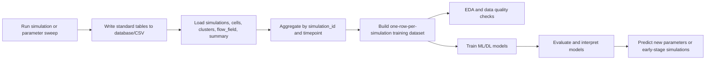
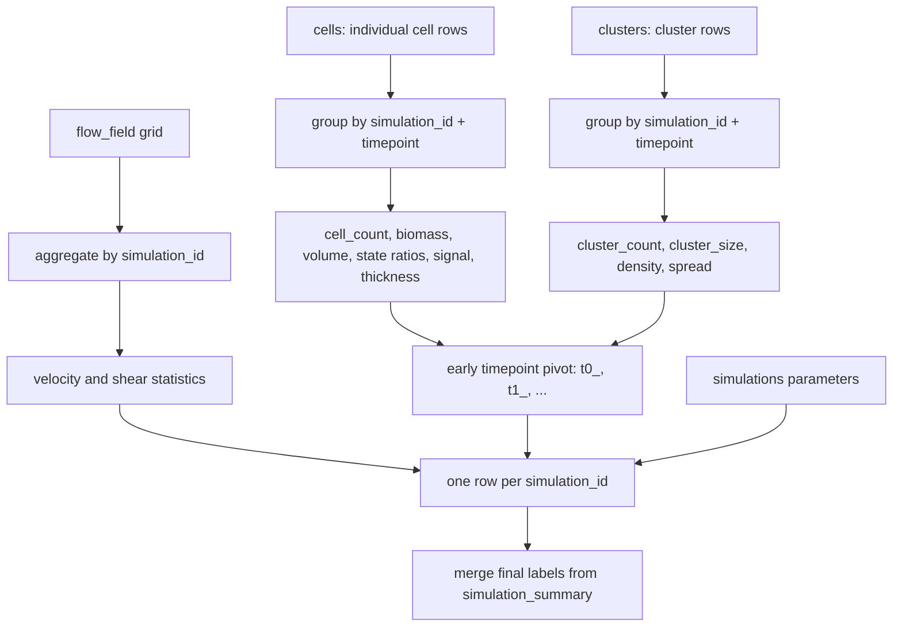

# Project Workflow

## Overview

The workflow connects simulation, database storage, feature engineering, model training, and interactive prediction.



## Standard Tables

`simulations` contains one row per simulation:

- simulation input parameters
- runtime
- random seed
- created time

`cells` contains cell-level time-series data:

- one row per cell per exported timepoint
- `simulation_id` links the row to a simulation
- `timepoint` orders the time series
- `state` stores biological/behavioral state

`clusters` contains cluster-level time-series data:

- one row per cluster per exported timepoint
- includes size, center position, and density

`flow_field` contains spatial flow-grid data:

- one row per grid point
- velocity components and shear

`simulation_summary` contains final outcomes:

- final cell count
- biofilm area/thickness
- surface coverage
- roughness
- QS/EPS fractions
- time to first cluster/stable biofilm

## How Large Data Is Generated

The database is not filled manually. It is generated automatically by:

- parameter sweep
- repeated random seeds
- repeated timepoints
- many cells per timepoint
- many clusters per timepoint
- many flow-grid points per simulation

Example:

```text
50 parameter combinations x 5 random seeds = 250 simulations
250 simulations x 100 exported timepoints x 500 cells
= 12,500,000 cell-level records
```

This is why DBeaver may show millions of rows even though you only ran a manageable number of simulations.

## Feature Engineering Logic

Correct modeling logic:



Important: cell rows are never used as independent training samples. They are process observations used to create simulation-level features.

## Figures And Interpretation

Spatial plots use the following convention:

- x-axis: position along the wall/flow direction.
- y-axis: distance from wall.
- wall is shown at `y = 0`.
- equal aspect ratio is used for cell and flow spatial plots.
- exported canvas coordinates are converted so biofilm growth appears upward from the wall.

Cell-state colors:

- planktonic: light gray
- attached: gray
- active: blue
- inactive: dark blue
- qs_active: red
- eps_producing: purple
- EPS matrix overlays: green/transparent green when available

Prediction plots:

- pred-vs-true x-axis = true value
- pred-vs-true y-axis = predicted value
- residual plot residual = true value - predicted value

## Recommended Thesis Workflow

1. Run enough simulations into the database.
2. Check DBeaver table counts.
3. Build the processed dataset from database.
4. Run EDA and verify data quality reports.
5. Train baseline models and MLP for each target.
6. Run cross-validation and ablation study for the main target.
7. Use feature importance and permutation importance to interpret key parameters.
8. Use the app to demonstrate prediction from new parameter combinations.

## Reproducible Commands

Initialize database:

```bash
.venv/bin/python src/database_init.py
```

Generate database data:

```bash
.venv/bin/python simulation/run_parameter_sweep.py \
  --config config.yaml \
  --shuffle \
  --shuffle_seed 20260502 \
  --max_runs 1000 \
  --runtime 100 \
  --export_interval 10 \
  --export database
```

Build features and train:

```bash
.venv/bin/python src/main.py \
  --source database \
  --target biofilm_thickness \
  --early_timepoints 10
```

Run app:

```bash
streamlit run app/streamlit_app.py
```
